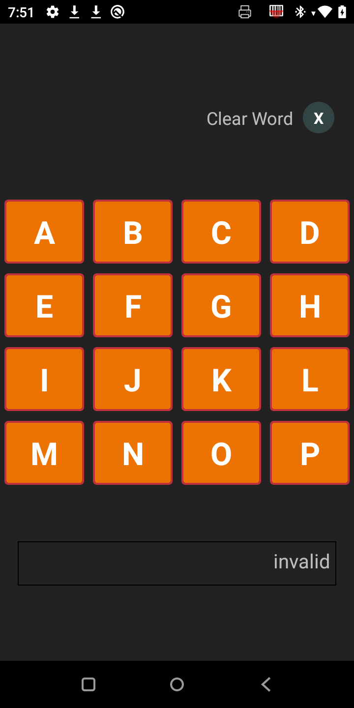
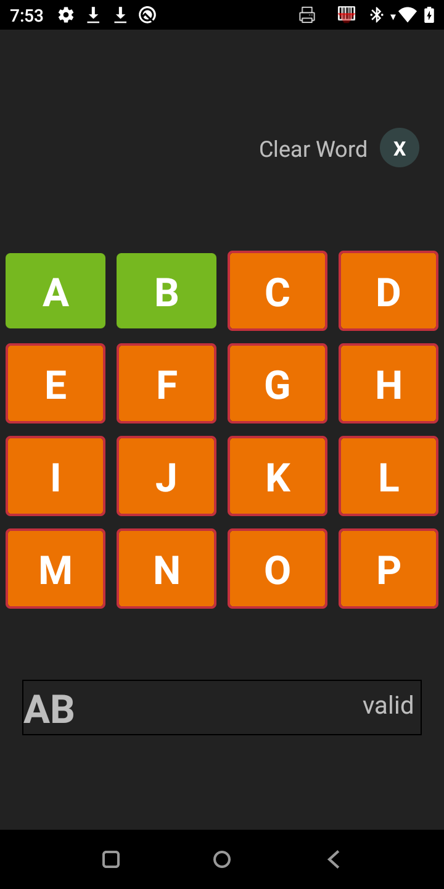
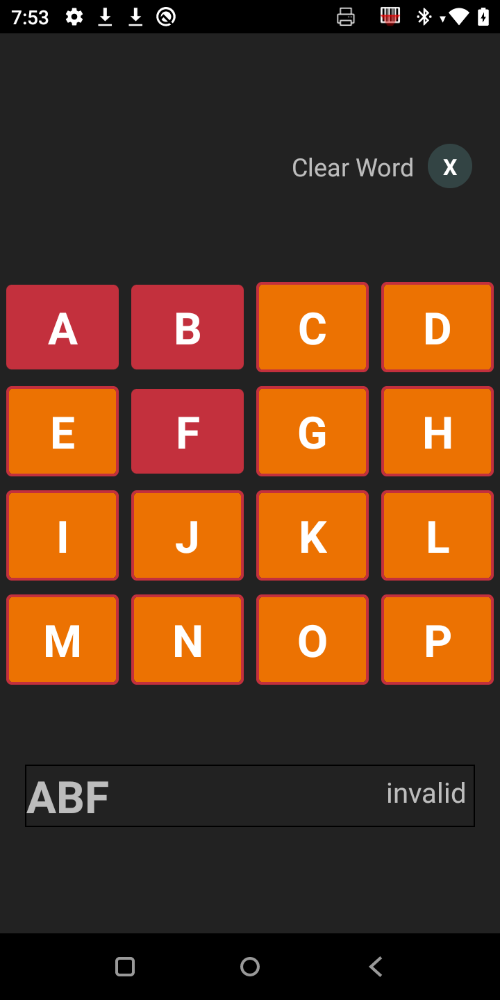

# Letter Game App

El proyecto esta creado con el CLI de React Native.

- No tiene dependencias de terceros
- Hacer la instalacion de paquetes segun el gestor:

```sh
npm install
o
yarn install 
```

#### Android 
- Para iniciar el proyecto en Andorid, primero debe ser abierto en Android Studio y abrir la carpeta `letter-game/android` la primera vez. Para que este se configure.

- Luego de hacer el paso anterior puede iniciar el proyecto con:

```sh
npm run android
o
yarn run android 
```

#### IOS
- Para iniciar el proyecto en IOS, primero debe descargar los paquetes:
```sh
cd ios
pod install
```

- Luego de hacer el paso anterior puede iniciar el proyecto con:

# Volver atras

```
cd ..    
```

# Ejecutar

```
npm run ios
o
yarn run ios
```


## Imagenes del proyecto

<p align="center">

</p>
 
<p align="center">

</p>
 
<p align="center">

</p>
 1